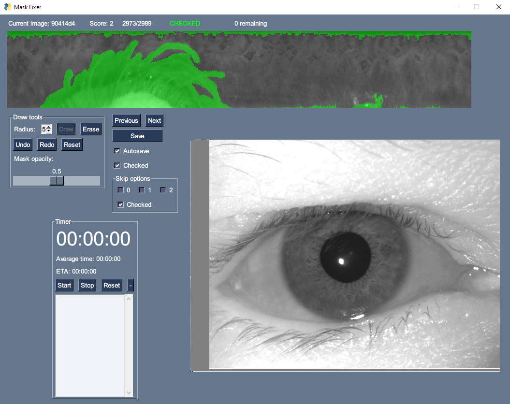

# fixMasks

This is a simple GUI to manually fix the occlusion masks of normalized iris images. It functions as a paint tool that allows easy drawing and fixing of the masks. The tool is written in Python and uses the PySimgleGUI library for the GUI.

New masks are stored within a `new_masks.npz` file. The list of images that have already been checked is stored in a .CSV file, which can be used to continue the work at a later time. This file also includes a `score` column, which I personally used for tracking different mask or image qualities.

Data is expected to be in a `data` folder, within the root of this project (outside the inner `fixMasks` file). The data should come in `.mat` files (which can be created using `numpy`), with the filename being the name of the dataset. Originally, two datasets were used: `left` and `right`, one for each eye. Thus, the code reflects this and should be refactored in order to work with other datasets or namings. Each `.mat` file should contain four matrices: `dataArray`, `labelArray`, `maskArray` and `imagesList`. The `dataArray` matrix should contain the normalized flattened iris images, shaped as `(N, M)` where `N` is the number of images and `M` is the number of pixels in each image. The `labelArray` matrix should contain the labels of the images (`0` or `1`), the `maskArray` matrix should contain the binary occlusion masks of the images (in the same shape of dataArray) and the `imagesList` matrix should contain the names of the images (`iris.py:7-11` should be modified, as it expects an old schema that I used for storing image information).

Additionally, original non-normalized images should be stored in a different folder, and its location should be set in the `_ORIGINAL_LEFT_PATH` and `_ORIGINAL_RIGHT_PATH` variables in `iris.py`. These images are used for visualization during mask fixing and may help discerning the occlusion areas. The original images should be named as the normalized images, but with the `.tiff` extension.

Masks are drawn using the cursor and clicking over the normalized image. Right clicking toggles the tool between drawing and erasing. Rotating the mouse wheel changes the size of the brush.

Scripts included in the `utils.py` file are not part of the main project and are only used for out-of-project data manipulation and visualization.

There may be things missing or not working properly, as this was a quick project that I made for my own use. Feel free to use it and modify it as you wish. Additionally, I am willing to offer support and help with any issues that may arise, in case you want to use this tool.

## License
This project is licensed under the MIT License - see the [LICENSE.md](LICENSE.md) file for details. Also you can cite my work if you find it useful: [Impact of Occlusion Masks on Gender Classification from Iris Texture](https://doi.org/10.1049/2024/8526857).
